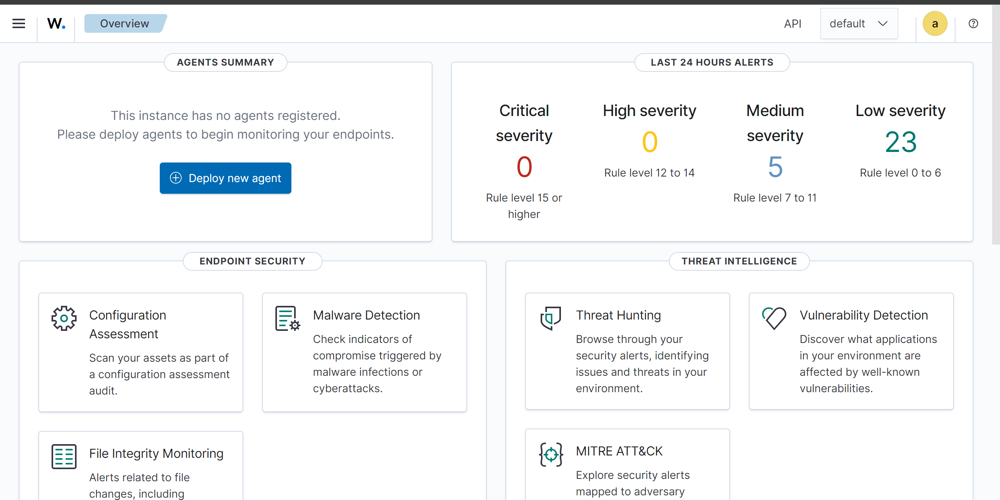
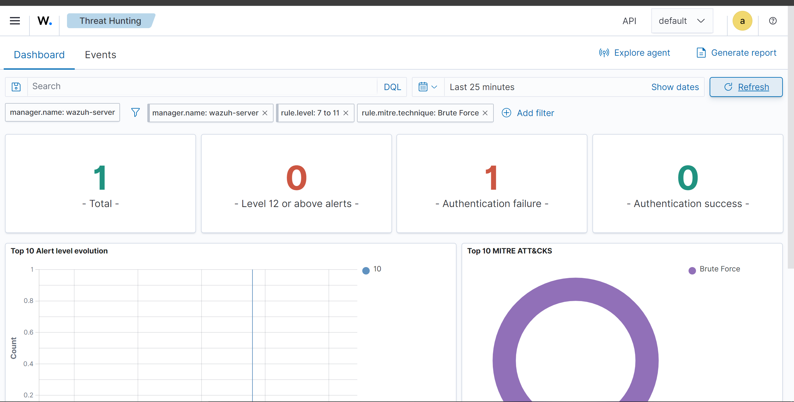

# 🛡️ SIEM Home Lab : Déploiement et Configuration Wazuh (XDR)

Ce dépôt documente la mise en place d'un environnement de détection d'intrusions (SOC / Blue Team) utilisant **Wazuh** et la suite **OpenSearch (Indexer)**. Il contient mes scripts d'automatisation, mes règles de détection personnalisées et les preuves de concept de mon laboratoire.

## 🏗️ Architecture du Lab

* **Wazuh Manager :** Déployé via une Appliance Virtuelle (OVA). Centralise la collecte, l'analyse des logs et la gestion des alertes.
* **Wazuh Dashboard :** Interface de visualisation pour le monitoring en temps réel et le Threat Hunting.
* **Surveillance :** Monitoring des logs système (auth.log) et analyse comportementale.

## 🚀 Contenu du Dépôt

1.  **`/scripts/`** : Scripts de déploiement (ex: `install_agent.sh` pour automatiser l'intégration d'un serveur au SIEM).
2.  **`/custom_rules/`** : Règles XML personnalisées pour affiner la détection et réduire les faux positifs.
3.  **`/screenshots/`** : Preuves de concept, captures d'écran du dashboard et des alertes de sécurité.

## 📊 Visualisation du Dashboard

Voici l'interface globale de mon instance Wazuh après configuration :

## 🎯 Scénario d'Attaque & Détection (Proof of Concept)

**Scénario :** Une attaque par Force Brute SSH (**MITRE ATT&CK T1110**) est lancée contre le serveur.

**Réponse du SIEM :**
1.  **Collecte :** Les échecs d'authentification sont capturés en temps réel.
2.  **Analyse :** Le moteur de règles identifie la répétition des tentatives depuis une même source.
3.  **Alerte :** Une alerte critique est générée et classée selon la matrice MITRE ATT&CK.

**Capture de l'alerte détectée :**

## 💡 Prochaines Étapes (Active Response)
* **Remédiation Automatisée :** Configuration de l'Active Response pour bloquer automatiquement les adresses IP malveillantes via `iptables` ou `firewalld` dès la détection d'une attaque brute force.
* **Intégration d'Agents :** Déploiement d'agents sur des endpoints Windows pour surveiller l'intégrité des fichiers (FIM).
